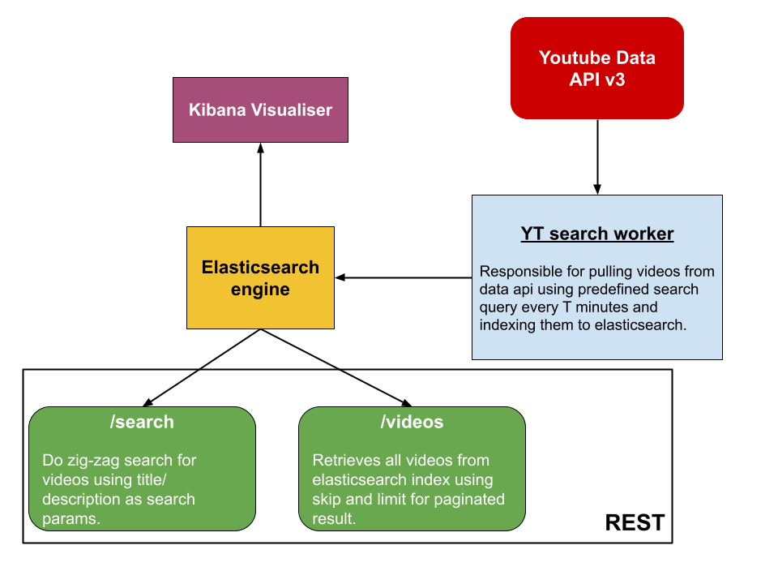

# yt-search

yt-search is minimal implementation of `search functionality` using **Elasticsearch** and **Youtube Data API** in Go.

## Starting the project

Create a `.env` file in root dir.

```bash
cat .sample.env > .env
```

Supply Youtube data API v3 `API_KEY` to the file.<br/>

Start the application with `docker-compose`

```bash
docker-compose -f dev.yml up -d
```

It will orchestrate our app, Elasticsearch and Kibana containers.

## Sample Requests

- **GET /videos**

```bash
curl --location --request GET 'localhost:8000/videos?skip=0&limit=10'
```

- **POST /search/videos**

```bash
curl --location --request POST 'localhost:8000/search/videos' \
--header 'Content-Type: application/json' \
--data-raw '{
    "title": "hotel",
    "description": "bitcoin"
}'
```

## Architecture



## Optimization and key highlights

- A more traditional approach for implementing search function in backend systems is to maintain data in SQL/NoSQL db and sync elasticsearch with it on a scheduled basis. While a similar approach could have been implemented here, but since we are pulling data from an API that is continuosly changing, directly indexing it to elastic search is much more efficient(which is implemented in this app).

- The worker that pulls data from API and pushes it to elasticsearch, though runs asynchronously in a different routine, halts execution in case of error occurence(as a channel is passed to it). This behaviour can be changed i.e the app can run completely independent of worker(even if worker is not running).

- Implementing elasticsearch provide powerful searching capability.

## Search Query Parms

```
Fields Extracted: {ID, Title, Description, PublishedAt, Thumbnail}
Queries: {"blockchain", "tesla", "dogecoin", "eth2.0", "elon musk", "maldives"}
Max Limit Of Video/ request: 60
Resource Type requested: Video
Result Sorted By: published_at
Published After: 15 days before timestamp of request
```

## TODO

- Auto rotation of multiple API keys on quota exhaustation.
- Vue.js search client with search text-watcher for real-time search.

## Author

**Akshit Sadana <akshitsadana@gmail.com>**

- Github: [@Akshit8](https://github.com/Akshit8)
- LinkedIn: [@akshitsadana](https://www.linkedin.com/in/akshit-sadana-b051ab121/)
